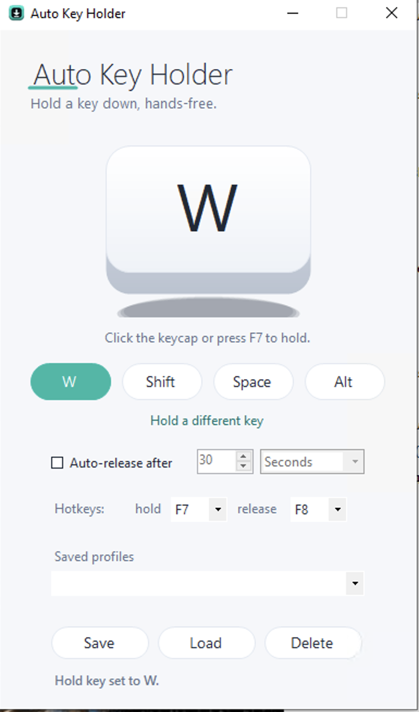

# AutoKeyHolder — Key Holder Software for Windows



**AutoKeyHolder** is a lightweight **key holder software** for Windows. It presses
a key and **holds it down** for you — hands-free — so you don't have to keep a finger on the
keyboard. One press starts the hold, and the key stays down until an auto-release timer
elapses or you release it with a second hotkey. A small Windows `.msi`
installer: no runtime to download, no loose DLLs.

Unlike a rapid tapper, AutoKeyHolder does not repeatedly tap a key — it keeps a **single key
held down** continuously. If you've ever needed to **auto hold key on Windows** — hold **W**
to keep moving, **Shift** to keep sprinting, **Space** to keep ascending, or **Alt** to keep
walking — this is the tool. It's just as handy at the desk for holding a key in an app that
expects a key to stay pressed.

---

## Features

- **Hold key picker** — click the key chip (or **Set key**) and press any key to choose the
  key to hold. One-click **presets** for **W / Shift / Space / Alt**.
- **Big HOLDING / RELEASED indicator** — always know at a glance whether the key is down,
  which key it is, and how long is left.
- **Auto-release timer** — optionally release the key on its own after **N seconds or
  minutes**, with a live countdown.
- **Release on a second hotkey** — a dedicated global release hotkey lets you drop the key
  instantly from any window.
- **Global hold hotkey** — start/stop the hold from any window without alt-tabbing
  (default **F7** to hold/toggle, **F8** to release; both choose F1–F12).
- **Saved profiles** — name and store multiple hold setups (key + auto-release + hotkeys);
  load any of them in one click.
- **System-tray** — minimizes to the tray with Hold / Release / Show controls.
- **Dark UI** with a calm teal accent. High-DPI aware.

Saved profiles live in a plain JSON file at
`%LOCALAPPDATA%\AutoKeyHolder\profiles.json` — easy to back up or copy between machines.

---

## How it works

AutoKeyHolder delivers the hold through the Windows `SendInput` API using hardware scan
codes: it issues a **key-down** and keeps the key down, refreshing it at a short interval so
the system's key-repeat keeps flowing, then a single **key-up** on release. Because it uses
scan-code input, the held key works reliably in most foreground apps and full-screen games.

There is **no global keyboard hook** anywhere in this program. The key picker reads a key
*only while its own chip has focus* — it never listens to what you type into other windows,
which keeps it clean for antivirus.

---

## Getting started

1. Download `AutoKeyHolder.zip` and extract it.
2. Run `AutoKeyHolder.msi` and follow the installer.
3. Pick the key to hold — press a preset (**W / Shift / Space / Alt**) or **Set key**.
4. Press **HOLD** (or the **F7** hotkey). The indicator turns to **HOLDING**.
5. Release with the **F8** hotkey, the **RELEASE** button, or let the **auto-release** timer
   drop it for you.

**Requirements:** Windows 7/8/10/11 with .NET Framework 4.8 (preinstalled on Windows 10/11).

---

## Typical uses

- **Hold key while playing** — keep moving, sprinting, ascending or walking in MMO/RPG and
  survival games without holding the key yourself.
- Holding a modifier or action key that an application expects to stay pressed.
- Accessibility: keeping a key held down comfortably for long stretches.
- Any single-player, hands-free "keep this key down" routine at the desk or in a game.

---

## Build from source

```bat
dotnet build src\AutoKeyHolder.csproj -c Release
```

Targets **.NET Framework 4.8**, WinForms. The build produces one portable
`AutoKeyHolder.exe` with no external dependencies.

Run the built-in headless check:

```bat
AutoKeyHolder.exe --selftest
```

It exercises the input core, the profile save/load round-trip, and the hold engine
(auto-release timer, second-hotkey release, refresh logic), printing `SELFTEST_OK` on
success.

---

## Disclaimer

This is a general-purpose keyboard utility. **Not affiliated with any game.** Use it in
accordance with the terms of service of any software you use it with. You are responsible
for how you use automated input on your own system.

---

## License

Released under the **MIT License**. See [LICENSE](LICENSE).
